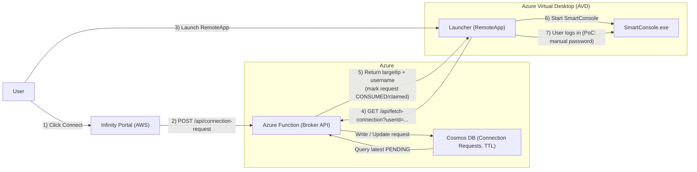
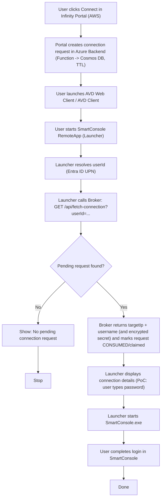

# Migration Project: Check Point Farm & Smart Console Access (AWS to Azure)

## 1. Project Overview
This document outlines the architecture and migration strategy for moving the Check Point "Farm" environment and the Smart Console access mechanism from Amazon Web Services (AWS) to Microsoft Azure. 

**Scope:**
*   **Source:** AWS (Current "Farm" and VDI access).
*   **Destination:** Azure.
*   **Out of Scope:** Check Point Infinity Portal (will remain in AWS).

## 1.1 PoC Snapshot (Jan 2026)

The Proof of Concept in this repo validates the Azure “Pull” model end-to-end using:

- **Broker:** Azure Functions (Python v2) + Cosmos DB (NoSQL) with per-item TTL (~60s), partition key `/userId`.
- **Launcher:** PowerShell wrapper in AVD that fetches a pending request and opens SmartConsole.
- **Login mode (PoC):** SmartConsole is launched with **no UI injection**; connection details are provided via environment variables.
- **RemoteApp:** Publish `powershell.exe` RemoteApp to run `C:\\S1C\\Launcher.ps1`.

This PoC deliberately avoids auto-login/password injection because SmartConsole versions R81+ are not reliably compatible with cleartext password injection mechanisms.

## 2. Current Architecture (AWS)

### 2.1 Components
1.  **Infinity Portal (AWS)**
    *   **Role:** User registration, authentication, and account management.
    *   **Function:** Acts as the entry point. Users select the specific Check Point Management Server they wish to manage.
    *   **Data:** Stores mapping of User -> Management Server (IP, Credentials).

2.  **The Farm (AWS)**
    *   **Infrastructure:** Amazon EC2 Instances.
    *   **Role:** Hosts Check Point Management Servers.
    *   **Tenancy:** 
        *   Single-tenant for normal customers.
        *   Multi-tenant/Multiple servers for MSP/MSSP customers.

3.  **Access Layer (AWS AppStream / Workspaces)**
    *   **Infrastructure:** AWS VDI Service (AppStream 2.0 or Workspaces).
    *   **OS:** Windows.
    *   **Software:** 
        *   Check Point Smart Console.
        *   Custom Decryption/Helper App.
    *   **Flow:** Delivers the Smart Console application UI to the user's browser or client.

### 2.2 Current Workflow ("Push" model)
1.  **User Action:** User logs into Infinity Portal and selects a Management Server to connect to.
2.  **Payload Generation:** Infinity Portal retrieves the target Management Server details (IP, Username, Password).
3.  **Encryption:** These details are encrypted.
4.  **Handoff:** The encrypted payload is passed to the AWS VDI service (AppStream).
5.  **Session Start:** A Windows session starts.
6.  **Decryption:** The custom helper app inside the Windows session receives the encrypted payload, decrypts it to clear text.
7.  **Auto-Login:** The helper app launches Smart Console and injects the credentials/IP.
8.  **Result:** User sees the Smart Console connected to their specific Management Server without typing credentials.

### 2.3 Authentication & Access Brokering (Infinity Portal + AWS AppStream)

**Infinity Portal authentication (current):**
- The portal authentication flow is vendor-managed and session-based.
- In the captured login HAR, authentication is initiated via a Check Point CloudInfra gateway endpoint under the portal domain (SAML-oriented), for example:
    - `https://cloudinfra-gw.portal.checkpoint.com/api/v1/ci-saml/authenticate` (with additional query parameters such as realm/sourceProductId).
- The result is an authenticated browser session (cookies on `*.checkpoint.com` / `*.portal.checkpoint.com`). After the session is established, subsequent portal actions rely on the session rather than repeatedly collecting credentials.
- Unless explicit federation is configured, there is no evidence in the default flow that an external IdP (for example AWS Cognito or Microsoft Entra ID) is participating.

**Infinity Portal “Login with GitHub” (observed):**
- The GitHub option appears to use a standard browser-based OAuth redirect flow.
- Observed redirect chain (host + path only):
    - `https://cloudinfra-gw.portal.checkpoint.com/oauth/github` → `https://github.com/login/oauth/authorize` → `https://github.com/login/oauth/select_account`
- A redacted capture is kept in [POC/Artifacts/har/github_login_redacted.har.json](POC/Artifacts/har/github_login_redacted.har.json) (headers, cookies, query strings, and bodies stripped).
- This is useful only as evidence that the portal can federate to an external IdP; enabling Microsoft Entra ID SSO would still require explicit vendor-side configuration/support.

**Smart-1 Cloud launch via AppStream (current):**
- The Infinity Portal acts as an access broker; the user does not authenticate to AWS directly.
- Clicking the Smart-1 Cloud tile triggers a browser call to a Check Point backend API authorized by the existing Infinity session, for example:
    - `https://cloudinfra-gw-us.portal.checkpoint.com/app/maas/api/v1/tenant/<tenant-guid>/appstream` (HTTP 200).
- The response contains a short-lived, service-generated AppStream authentication URL, for example:
    - `https://appstream2.us-east-1.aws.amazon.com/authenticate?parameters=<...>&signature=<...>`
- This indicates a delegated brokered launch: Check Point (server-side) uses its AWS trust/permissions to mint a signed one-time AppStream launch token; AppStream validates the token and starts the streaming session.

### 2.4 AWS Environment Artifacts & User Experience
**Observed URL Structure (AppStream):**
The connection process involves a URL transition:

**Phase 1: Reservation (`#/reserve`)**
Initial request to reserve a session instance.
```
https://63a5b2f67a09659106a68182d383d8645f3ccda0e1cf7b76689df1d7.appstream2.us-east-1.aws.amazon.com/#/reserve
?app=SmartConsole
&reference=fleet%2FSmartConsoleR82-TF
&context=o9tGeBss6rykoTPx%2BaPyuJyQJGRdX1MmhvgRbTObQ4%2FLzqLqPMoLjE%2B7%2Fkk6YuZ7cVwT%2BDFgoqTLFXGThZ5yRqjyi%2BSqUVJnY6GNkHGRt5fHoCYxPVp962Z0dyD8w2S0xRF9d4AZ%2Ba%2Bs2779sScYJk4ipQ5AeJyGdTxHEnx176VrcJlkag6rpm97SSezrFwdpqs%2BNBBVZxaOh5c31SoTTGmojvGYvMquRcpdyL5Yb1k%3D
```

**Phase 2: Streaming (`#/streaming`)**
Once reserved, the URL changes to the active streaming session.
```
https://63a5b2f67a09659106a68182d383d8645f3ccda0e1cf7b76689df1d7.appstream2.us-east-1.aws.amazon.com/#/streaming
?reference=fleet%2FSmartConsoleR82-TF
&app=SmartConsole
&context=o9tGeBss6rykoTPx%2BaPyuJyQJGRdX1MmhvgRbTObQ4%2FLzqLqPMoLjE%2B7%2Fkk6YuZ7cVwT%2BDFgoqTLFXGThZ5yRqjyi%2BSqUVJnY6GNkHGRt5fHoCYxPVp962Z0dyD8w2S0xRF9d4AZ%2Ba%2Bs2779sScYJk4ipQ5AeJyGdTxHEnx176UCrnimIe9Xzlk7aqFB8rlc2JYYHZE2uK18NoFYBg88xhpTrhyfMOc6JSo6zODaGH4%3D
```
*   **Domain:** `appstream2.us-east-1.aws.amazon.com` (Confirming AWS AppStream 2.0).
*   **Fleet:** `SmartConsoleR82-TF` (Indicates the image/fleet name).
*   **Context:** The large encrypted string containing the session credentials.

**Visual State (Screenshots):**
> *Note: Screenshots are referenced here. Please upload the image files to the repository to view them.*

1.  **Infinity Portal Dashboard:** Shows the "Smart-1 Cloud" service with an "Open" button.
    

2.  **Service Page:** Displays "Open Web SmartConsole" and "Open Streamed SmartConsole".
    *   Also shows "SmartConsole connection token" (e.g., `roie9876-dejucj4n/c4b83f3f...`).
    

3.  **AppStream Loading:** Browser redirects to the AWS AppStream URL, showing the "SmartConsole R82" splash screen and "Connecting to Smart-1 Cloud" with the user identifier.
    

4.  **Smart Console UI:** The full Windows application running inside the browser window.
    

### 2.5 Technical Analysis of AWS AppStream Flow (Confirmed via Trace)
Based on the analysis of the network trace (`portal.checkpoint.com.har`), the flow is confirmed as follows:

1.  **API Call to Infinity Portal:**
    *   **Request:** `GET https://cloudinfra-gw-us.portal.checkpoint.com/app/maas/api/v1/tenant/<TENANT_ID>/appstream`
    *   **Headers:** Includes `x-access-token` for authentication.
    *   **Purpose:** The client asks the backend for a connection URL for the specific Tenant ID (e.g., `8bac9fb5...`).

2.  **Backend Response:**
    *   **Status:** `200 OK`
    *   **Body:**
        ```json
        {
            "url": "https://...appstream2.us-east-1.aws.amazon.com/..."
        }
        ```
    *   **Mechanism:** The backend generates a pre-signed or parameterized URL containing the session context.

3.  **The "Push" Mechanism:**
    *   The `parameters` query string in the AppStream URL is a Base64 encoded JSON object.
    *   This JSON contains the sensitive session data (User, Password, Target IP) in an encrypted field named `userContext`.
    *   **Conclusion:** The sensitive data is **pushed** to the AppStream instance via this URL parameter.

4.  **Implications for Azure:**
    *   **Azure Virtual Desktop (AVD) Web Client does NOT support this.** We cannot pass a `&context=` parameter in the AVD URL.
    *   **Conclusion:** We must abandon the "Push" model and implement the **"Pull" model** (described in Section 4), where the application fetches its configuration from the backend after launch.

---

## 3. Migration Constraints (Why AVD is different)

1.  **No sensitive context in the AVD URL:** AVD Web Client does not support an AppStream-style `&context=` parameter.
2.  **No portal-minted AVD login token:** Unlike AppStream `.../authenticate?...&signature=...`, there is no supported mechanism for a third-party portal to mint a signed one-time URL that logs the user into AVD without Microsoft Entra ID authentication.
3.  **Identity must align to Entra ID:** Any “pull” lookup must be keyed by the Entra ID identity in the session (typically UPN/email).

## 4. Proposed Architecture (Azure)

### 4.0 Architecture Figure (Infinity Portal + AVD + Function + Cosmos)



### Core Concept: The "Pull" Model with Connection Queue
Since we cannot push context via the URL in AVD, and users may have multiple concurrent connections (MSSP scenario), we will implement a **"Connection Request Queue"** pattern.

### Components
1.  **Infinity Portal (AWS - Existing)**
    *   **Role:** User Interface.
    *   **New Action:** Instead of generating a URL with a payload, it writes a "Connection Request" to the Azure Backend.

2.  **Azure Backend (New)**
    *   **Component:** Azure Functions + Azure Cosmos DB (or Redis/Queue Storage).
    *   **Role:** Stores "Pending Connection Requests".
    *   **Data Structure:**
        ```json
        {
            "userId": "roie@mssp.com",
            "requestId": "guid-123",
            "targetIp": "1.2.3.4",
            "credentials": "{encrypted}",
            "status": "PENDING", // or CONSUMED
            "timestamp": "2023-10-27T10:00:00Z"
        }
        ```

3.  **Azure Virtual Desktop (AVD)**
    *   **Host Pool:** Windows 10/11 Multi-session.
    *   **Identity:** Entra ID (Azure AD) joined.
    *   **Published App:** "Smart Console Launcher" (Custom Wrapper).

4.  **The "Launcher" App (Custom Exe)**
    *   **Role:** The actual application published to users.
    *   **Logic:**
        1.  Starts up.
        2.  Identifies the user (via Windows Identity/SSO).
        3.  Calls Azure Backend: *"Do I have a pending connection request?"*
        4.  Backend returns the details (IP, Creds).
        5.  Launcher marks request as `CONSUMED`.
        6.  Launches `SmartConsole.exe` with the retrieved credentials.

### 4.1 Detailed Workflow (The "Queue" Flow)

#### Normal user login flow (Mermaid)



1.  **User Action (Portal):**
    *   User logs into Infinity Portal (AWS).
    *   User selects "Customer A - Firewall 1" and clicks "Connect".

2.  **Request Staging (Backend):**
    *   Infinity Portal calls Azure API: `POST /api/connection-request`.

3.  **User Launch (AVD):**
    *   User is redirected to the AVD Web Client (or opens their AVD Client).
    *   User launches the **"Smart Console"** RemoteApp.

4.  **Context Retrieval (Launcher):**
    *   The "Launcher" app starts in the AVD session.
    *   It calls `GET /api/fetch-connection?userId=roie@mssp.com`.
    *   API checks Cosmos DB for the *latest* `PENDING` request for this user.
    *   API returns the details for "Customer A" and updates status to `CONSUMED`.

5.  **Application Start:**
    *   **PoC behavior:** Launcher starts SmartConsole and pre-fills username + server/IP. The user types the password manually.
    *   **Future:** Evaluate supported SSO/token-based approaches if true auto-login is required.

6.  **MSSP Scenario (Multiple Connections):**
    *   User goes back to Portal, clicks "Customer B".
    *   Portal creates *new* `PENDING` request for "Customer B".
    *   User launches "Smart Console" again (AVD allows multiple instances or user starts a new session).
    *   New Launcher instance starts -> fetches "Customer B" -> Launches Console B.
    *   **Result:** User has two windows open: one for A, one for B.

## 5. Key Challenges & Solutions

### Challenge 1: Identity Provider Mismatch (Infinity Portal vs. Entra ID)
**Problem:** Infinity Portal uses a proprietary IdP. AVD requires Entra ID (Azure AD).
**Solution:**
*   **Federation (Recommended):** Configure Federation (SAML/OIDC) between the Infinity Portal IdP and the Azure Entra ID tenant. This ensures that when a user logs into AVD, they are recognized as the *same identity* that initiated the request in the portal.
*   **B2B Guest Users:** Alternatively, provision Infinity Portal users as B2B Guest users in the Azure tenant.
*   **Mapping:** The "Connection Request" must be tagged with the **Entra ID UPN** of the user. If the Portal knows the user as `roie`, but Entra knows them as `roie_gmail.com#EXT#@...`, the Portal must write the request using the Entra UPN so the Launcher can find it.

**Why AppStream-style brokering does not translate to AVD RemoteApp:**
- With AppStream, the portal can redirect the browser to an AWS `.../authenticate?...&signature=...` URL that AWS accepts without the user logging into AWS.
- With AVD RemoteApp, there is no supported equivalent where a third-party portal can mint a signed one-time login URL/token that bypasses user authentication.
- AVD access is brokered using Microsoft Entra ID authentication and Entra-issued tokens; user sign-in and Conditional Access are enforced by Entra.

**Implication (SSO requirement):**
- To achieve a “click in Infinity Portal -> RemoteApp launches with no extra login prompts”, Microsoft Entra ID must be the shared identity authority for both the portal and AVD.
- Practically this means:
    - Federate the Infinity Portal to Microsoft Entra ID (Infinity acts as Service Provider; Entra acts as Identity Provider).
    - Ensure consistent identity mapping (typically UPN/email) and any required group/role claims.
    - Configure AVD for Entra-based SSO so an existing Entra browser session can be reused silently.
    - Launch the RemoteApp using AVD-supported deep links / launch URLs.
    - Expect Conditional Access to influence whether the user is prompted again (MFA, device compliance, sign-in frequency, etc.).

### Challenge 2: Passing Credentials to RemoteApp
**Problem:** How to inject retrieved credentials into the Smart Console application?
**Solution: The Launcher Pattern**
*   We do not publish `SmartConsole.exe` directly.
*   We publish a custom **Launcher** (C#/.NET or PowerShell wrapper).
*   **PoC Mechanism (current):**
    *   The Launcher fetches the pending request (server/IP + username).
    *   It launches SmartConsole and uses UI automation to pre-fill fields.
    *   The user types the password manually.
    *   This avoids putting passwords into command line arguments.

*   **RemoteApp detail (important):**
    *   When publishing a PowerShell-based RemoteApp, the session often ends when the published process exits.
    *   The PoC launcher keeps the RemoteApp alive by waiting for the SmartConsole process to exit.

### Challenge 3: "Pull" Model Latency
**Problem:** User clicks "Connect", then launches app. What if they launch the app *before* clicking connect?
**Solution:**
*   The Launcher should have a simple UI.
*   If no PENDING request is found, the Launcher displays: *"No pending connection found. Please initiate a connection from the Infinity Portal."*
*   It can include a "Refresh" button to poll the queue again.

### Challenge 4: Latency (Network + User Experience)
**The Issue:** The Management Server is in Azure, the Smart Console (AVD) is in Azure, but the User is remote.
**Solution:**
*   Ensure AVD Host Pool and Management VM Farm are in the **same Azure Region** to minimize console-to-server latency.
*   Use **AVD RDP Shortpath** to optimize the UDP connection from the user's home/office to the Azure VDI.

### Challenge 5: Automation & Orchestration
**The Issue:** Creating new Management Servers for new customers automatically.
**Solution:**
*   Use **Terraform** or **Bicep** to define the Management Server VM template.
*   Trigger deployment via **Azure Functions** when a new customer signs up in Infinity Portal.

## 6. Portal Routing & Entry Point (Migration Strategy)

**New Discovery:**
*   **Unique Login URL:** `https://portal.checkpoint.com/signin/cp/<SHORT_ID>` (e.g., `c4b83f3f`)
*   **Account ID:** Full GUID (e.g., `c4b83f3f-b864-4c83-ad62-5df7deb98146`)

**Architectural Significance:**
This URL acts as the **Tenant Resolver**.
1.  **Entry:** User hits the Unique Login URL.
2.  **Resolution:** Infinity Portal resolves `<SHORT_ID>` to the full **Account ID**.
3.  **Routing:** The Portal knows which "Farm" (AWS or Azure) this account belongs to.
4.  **Migration Strategy:**
    *   This URL remains hosted in AWS (Infinity Portal).
    *   When user logs in, Portal checks: "Is Account `<SHORT_ID>` migrated to Azure?"
    *   **If True (Azure):** Redirect user to the **AVD Web Client** URL instead of the AppStream URL.

**Updated User Journey:**
1.  User clicks `https://portal.checkpoint.com/signin/cp/<SHORT_ID>`
2.  Infinity Portal authenticates user.
3.  Portal checks DB: "Where is Account `<SHORT_ID>` hosted?" -> **Answer: Azure**.
4.  Portal generates "Connection Context" (User/Pass/IP) and saves to backend (short-lived).
5.  Portal redirects browser to: `https://windows.cloud.microsoft/webclient/...`
6.  AVD Session starts -> Launcher pulls context -> Smart Console launches.

## 7. Deep Dives & Design Notes

### 7.1 User Experience Validation (Based on Smart-1 Cloud)

**Current Experience (AWS):**
*   **Interface:** The user sees the Smart Console UI directly inside their web browser (as shown in your screenshot).
*   **URL Structure:** `https://portal.checkpoint.com/dashboard/security-management#/mgmt/<MANAGEMENT_ID>/policy`
*   **Mechanism:** This confirms the use of **AppStream 2.0 Web Client** (or similar HTML5 VDI client) which embeds the Windows application into the browser.

**Target Experience (Azure):**
*   **Goal:** Replicate this exact "App-in-Browser" feel.
*   **Technology:** **Azure Virtual Desktop (AVD) Web Client**.
*   **Flow:**
    1.  User navigates to the Portal URL.
    2.  Portal authenticates user.
    3.  Portal detects "Azure Tenant".
    4.  **Context Lookup:** The `<MANAGEMENT_ID>` (e.g., `ifmRJurBAnvXSDfVUwXyv8`) is the key used by the Helper App to fetch the correct IP/Credentials from the backend.

### 7.2 Deep Dive: The "Connection Token" & AppStream URL Analysis

**New Discovery:**
*   **Connection Token Format:** `ServiceIdentifier/AccountID/PortalDomain`
    *   Example: `roie9876-dejucj4n/c4b83f3f-b864-4c83-ad62-5df7deb98146/portal.checkpoint.com`
*   **AppStream URL Structure:**
    *   `https://...appstream2.us-east-1.aws.amazon.com/#/streaming`
    *   `?reference=fleet%2FSmartConsoleR82-TF`
    *   `&app=SmartConsole`
    *   `&context=...` (A massive encrypted string!)

**Analysis of the AWS "Context" Parameter (Decoded):**
The `&context=` parameter in the URL is exactly what we suspected. It contains the encrypted payload (User, Pass, IP, Token) that the AppStream instance receives.

**Decoded JSON Structure:**
```json
{
  "type": "END_USER",
  "userContext": "...", // Encrypted Blob
  "maxUserDurationInSecs": "7200"
}
```
*   **AWS Mechanism:** AppStream passes this `userContext` string to the instance. A script on the instance reads it, decrypts it, and logs the user in.

**Azure Equivalent Strategy (Refined):**
Since AVD Web Client **does not** support a `&context=` parameter in the URL (as confirmed in Challenge 1), we **cannot** simply copy-paste this URL structure.

**The "Pull" Model is Mandatory:**
1.  **Infinity Portal** will generate the same "Connection Token" (`roie9876...`).
2.  Instead of putting it in the URL, it saves it to the **Backend Database** linked to the User's Identity.
3.  **Redirect:** Portal redirects user to `https://windows.cloud.microsoft/webclient/...` (No context string).
4.  **Execution:**
    *   AVD Session starts.
    *   Helper App (Launcher) starts.
    *   Helper App asks Backend: "Give me the context for User X".
    *   Backend returns the "Connection Token" and credentials.
    *   Helper App launches Smart Console.

### 7.3 Context Store Technology Selection (Key Vault vs. Redis)

**Option A: Azure Key Vault**
*   **Mechanism:**
    *   Portal writes a Secret: `Name: Session-Roie`, `Value: {EncryptedContext}`.
    *   AVD reads Secret `Session-Roie`.
*   **Pros:** Highly secure, built-in encryption.
*   **Cons (Scale):** Key Vault has **throttling limits** (e.g., 2,000 requests/10 seconds). If 5,000 users log in at 9:00 AM, it will fail. It is designed for *static* secrets, not high-frequency dynamic data.

**Option B: Azure Redis Cache (Recommended)**
*   **Mechanism:**
    *   Portal writes Key: `Session:Roie`, Value: `{EncryptedContext}`, TTL: 60s.
    *   AVD reads Key.
*   **Pros:**
    *   **Speed:** Sub-millisecond latency.
    *   **Scale:** Handles millions of requests per second.
    *   **TTL:** Built-in "Time To Live" automatically deletes old sessions (perfect for our "Active Launch" logic).
*   **Security:** Can be secured with Private Endpoints and Access Keys.

**Decision:**
For the **Proof of Concept (PoC)**, Key Vault is fine and easy to set up.
For **Production**, we **must use Redis** (or Cosmos DB) to handle the scale of thousands of concurrent users.

### 7.4 Handling Multi-Tenancy (MSSP Scenario)

**The Challenge:**
A single user (e.g., `roie@mssp.com`) might have access to **multiple** Management Servers (Customer A, Customer B, Customer C).
If the Helper App just asks "Give me the context for `roie@mssp.com`", the backend won't know *which* specific server the user intends to connect to right now.

**The Solution: The "Active Session" State**
Since we cannot pass the "Target ID" in the URL, we must rely on the **Time-Based Active Session State** in the backend.

**The Workflow:**
1.  **Selection (Infinity Portal):**
    *   User `roie@mssp.com` is on the Infinity Portal.
    *   He clicks "Connect" on **Customer A**.

2.  **Staging (Backend):**
    *   The Infinity Portal Backend sets a **Short-Lived State** (e.g., 60 seconds TTL) in the database:
    *   *Key:* `ActiveLaunch:roie@mssp.com`
    *   *Value:* `{ Target: "Customer A", Token: "..." }`

3.  **Launch (AVD):**
    *   Portal immediately redirects Roie to AVD.
    *   AVD Session starts.

4.  **Retrieval (Helper App):**
    *   Helper App calls Backend: "What is the **active launch request** for `roie@mssp.com`?"
    *   Backend checks `ActiveLaunch:roie@mssp.com`.
    *   Backend returns "Customer A".
    *   Backend **deletes** the key (to prevent replay or confusion).

5.  **Result:**
    *   Smart Console opens for Customer A.

### 7.5 Context Lifecycle & Concurrency Handling

**The "Temporary" Nature of the Context:**
The context stored in the backend (Key Vault/Redis) is **transient**. It exists only to bridge the gap between the user's click in the Portal and the application launch in Azure.

**Lifecycle Steps:**
1.  **Creation:** Triggered by the "Connect" click.
2.  **Expiration (TTL):** Set to **60 seconds**. If the user closes the browser or the network fails, the key self-destructs to prevent stale data.
3.  **Consumption & Deletion:**
    *   The Helper App reads the key.
    *   The Backend **immediately deletes** the key upon successful read.
    *   **Reason:** Prevents "Replay Attacks" (malicious actors trying to reuse the session) and ensures hygiene.

**Concurrency Scenario (The "Double Click" Problem):**
*   **Scenario:** User Roie clicks "Connect Customer A", then 2 seconds later clicks "Connect Customer B".
*   **Behavior:**
    *   Click 1 sets Key = `Customer A`.
    *   Click 2 **overwrites** Key = `Customer B`.
    *   **Result:** Both AVD sessions (if they both launch) will read `Customer B`.
*   **Verdict:** This "Last Write Wins" behavior is acceptable for this use case. It prevents the user from accidentally connecting to the wrong (old) target.

**Multiple Simultaneous Sessions:**
*   If Roie connects to Customer A (Session 1 starts, Key deleted).
*   Then 1 minute later, Roie connects to Customer B (Session 2 starts, New Key created/deleted).
*   **Result:** Both sessions run in parallel without conflict because the first key was already gone.

**Edge Case: Multiple Tabs?**
*   If Roie clicks "Connect Customer A" and then immediately clicks "Connect Customer B" in another tab *before* the first session starts, the `ActiveLaunch` key might be overwritten.
*   **Mitigation:** This is a rare race condition. The "Launch" process is usually blocking or modal. The short TTL (Time To Live) ensures that old clicks don't linger.

### 7.6 Identity Migration (The "Entra ID" Requirement)

**The Gap:**
*   **Current State (AWS):** Users authenticate against a custom Identity Provider (IdP) or local DB in Infinity Portal. Their identity is passed to AWS AppStream via the encrypted context.
*   **Target State (Azure):** Azure Virtual Desktop (AVD) **requires** users to exist in **Microsoft Entra ID (Azure AD)** to log in. You cannot use AVD without Entra ID.

**The Migration Task:**
We must synchronize the Infinity Portal users into a dedicated Entra ID tenant.

**Strategy: "Shadow Accounts" (B2B or B2C)**
Since Infinity Portal owns the "Real" identity, the Azure identities are just "Shadows" used for access.

**Option A: Entra ID External Identities (B2B)**
1.  **Trigger:** When a user is migrated to Azure (or on first login).
2.  **Action:** Infinity Portal uses the Microsoft Graph API to **invite** the user (`roie@gmail.com`) to the Azure Tenant as a **Guest User**.
3.  **Flow:**
    *   User clicks "Connect".
    *   Portal redirects to AVD.
    *   AVD prompts for Microsoft Login (or uses SSO if federated).
    *   Session starts.

**Option B: Dedicated "Cloud-Only" Users**
1.  **Trigger:** Migration.
2.  **Action:** Create a cloud-only user `roie_gmail_com@checkpoint-farm.onmicrosoft.com` in the Azure Tenant.
3.  **Password:** Generate a random complex password.
4.  **SSO:** This is harder because the user doesn't know this password. We would need to implement a custom **SAML/OIDC Federation** where Infinity Portal acts as the IdP for Entra ID.

**Recommended Approach: Custom SAML Federation**
*   **Configure Entra ID** to trust **Infinity Portal** as an Identity Provider.
*   **Flow:**
    1.  User goes to AVD URL.
    2.  AVD redirects to Entra ID.
    3.  Entra ID sees domain `@checkpoint-portal.com` and redirects to Infinity Portal.
    4.  Azure logs Roie in.
*   **Benefit:** Seamless SSO. No new passwords. No "Guest" invites.

## 8. PoC Implementation Specifications

### 8.1 Component: Azure Cosmos DB
*   **Database Name:** `S1C_Migration`
*   **Container Name:** `ConnectionRequests`
*   **Partition Key:** `/userId` (Optimizes queries by user)
*   **Time to Live (TTL):** Enable on Container (Default: 60 seconds). This ensures requests auto-expire if not consumed.

**Document Schema:**
```json
{
    "id": "guid-generated-by-portal",
    "userId": "roie@mssp.com",
    "targetIp": "10.0.0.5",
    "credentials": "encrypted-string",
    "status": "PENDING",
    "timestamp": "2023-10-27T12:00:00Z",
    "ttl": 60                         // Auto-delete after 60s
}
```

### 8.2 Component: Azure Function (The Broker)
*   **Runtime:** Python or C# (Consumption Plan is fine).
*   **Function 1: `QueueConnection` (POST)**
    *   **Input:** JSON body (same as schema above).
    *   **Logic:** Writes the document to Cosmos DB with `status: "PENDING"`.
*   **Function 2: `FetchConnection` (GET)**
    *   **Input:** Query param `?userId=roie@mssp.com`.

### 8.3 Component: PowerShell Launcher (The Client)
*   **Location:** Runs inside the AVD Session (User Context).
*   **Logic Flow:**
    ```powershell
    $apiUrl = "https://my-func.azurewebsites.net/api"
    $user = Get-CurrentUserUPN
    
    # Poll for connection
    $response = Invoke-RestMethod -Uri "$apiUrl/fetch_connection?userId=$user"
    
    if ($response.status -eq "FOUND") {
        $args = "-u $($response.user) -p $($response.pass) -t $($response.ip)"
        Start-Process "SmartConsole.exe" -ArgumentList $args
    } else {
        Write-Host "No pending connection found."
    }
    ```
